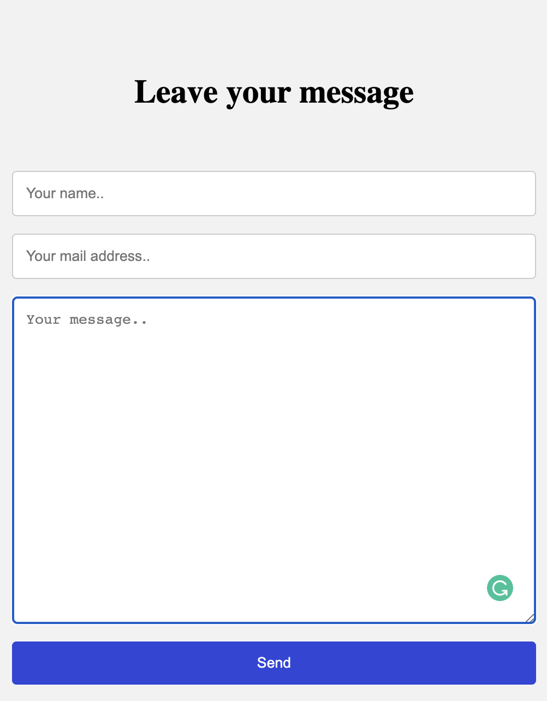
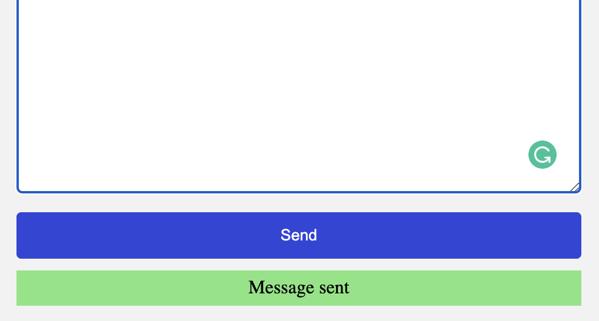

# React Form using Hooks

## Create the React Form using useState and useEffect and save the form data in the Local Storage

### In this project I used React JS with hooks:
- `useState()`
- `useEffect()`

## Interesting features impelemented:
- Created the contact form by using `useState()` hook to handle all inputs
- Used `useEffect()` hook to monitor any changes in inputs and save in `localStore`
- Used canditional rendering, when the form is submitted (display success message)

### Built with

- React JS

### Run project on local machine

- copy and run this command to your terminal `git clone https://github.com/elmar8287/react-form-hooks.git`
- switch to right directory by `cd react-form-hooks`
- instal npm by running this command `npm i`
- start the project by running this command `npm start`

## Author

- GitHub: [@elmar8287](https://github.com/elmar8287)
- LinkedIn: [Elmar Abdulkarimov](https://www.linkedin.com/in/elmar.abdulkarimov/)

## 🤝 Contributing

Contributions, issues, and feature requests are welcome!

Feel free to check the [issues page](https://github.com/elmar8287/react-form-hooks/issues).

## Show your support

Give a ⭐️ if you like this project!

License could be find [here](https://github.com/elmar8287/react-form-hooks/blob/dev/LICENSE)

